# Babis Post - Introduction
Project milestone 4 for Code Institute Full-stack development program.
This project is a Full Stack website built using the Django framework.
was created with the purpose of bringing people together specifically of bringing the little ones of the family with their loved relatives nowadays there are multiple social media sites that have become too crowded and they have lost certain kind of intimacy and privacy for this project I asked 10 parents about how they felt posting pictures of their kids and the main stream social media‘s and ate them and replied that they just didn’t feel comfortable anymore since they didn’t know who might be watching personally I have a nine-month-old baby and I live abroad and all my relatives and friends back home are constantly demanding for information about my son so instead of sending pictures and videos to all of them separately I decided that maybe if I could create a daily diary where people could see what is going on in Theo’s life that would prevent me from spending all the time I spend every day sharing stories with our loved ones.

[Live Project Here](https://babis-app.herokuapp.com/)

- [Babis Post - Introduction](#babis-post---introduction)
  - [User Experience - UX](#user-experience---ux)
    - [User Stories](#user-stories)
    - [Agile Methodology](#agile-methodology)
    - [The Scope](#the-scope)
      - [Main Site Goals](#main-site-goals)
  - [Design](#design)
      - [Colours](#colours)
      - [Typography](#typography)
      - [Imagery](#imagery)
    - [Wireframes](#wireframes)
  - [Database Diagram](#database-diagram)
  - [Features](#features)
    - [Home Page](#home-page)
    - [Home Page - Highlight Posts](#home-page---highlight-posts)
    - [About Page](#about-page)
    - [Blog Page](#blog-page)
    - [Post Detail Page - Top](#post-detail-page---top)
    - [Post Detail Page - Steps](#post-detail-page---steps)
    - [Post Detail Page - Comments](#post-detail-page---comments)
    - [Signup Page](#signup-page)
    - [Login Page](#login-page)
    - [Logout Page](#logout-page)
    - [User Profile Page](#user-profile-page)
    - [Navbar](#navbar)
    - [Footer](#footer)
    - [Login](#login)
    - [Logout](#logout)
  - [Admin Panel/Superuser](#admin-panelsuperuser)
  - [Technologies Used](#technologies-used)
    - [Languages Used](#languages-used)
      - [Django Packages](#django-packages)
    - [Frameworks - Libraries - Programs Used](#frameworks---libraries---programs-used)
  - [Creating the Django app](#creating-the-django-app)
  - [Deployment of This Project](#deployment-of-this-project)
  - [Final Deployment](#final-deployment)
  - [Credits](#credits)
    - [Content](#content)
    - [Information Sources / Resources](#information-sources--resources)
  - [Special Thanks](#special-thanks)

## User Experience - UX

### User Stories

* As a website user, I can:

1. Navigate around the site and easily view the desired content.
2. View a a feeds post page where I can see posts.
3. View the number of likes on the posts.
4. View comments on posts made by others.
5. Delete my own posts.
6. Like or Dislike posts.
7. Update my posts.
8. Add Child profiles if I am parent.
9. Logout from the website.

* As a website superuser, I can:

1. Create and publish posts.
2. Create comments.
3. Add a new user.
4. Delete friends.
5. Delete users posts.
6. Edit user's posts.
7. Delete users comments.
8. Change the users type of user.

### Agile Methodology

All functionality and development of this project were managed using GitHub which Projects can be found
[here](https://github.com/Danpr1984/babis)

### The Scope

#### Main Site Goals

* To provide users with a good experience when using the Babis post website.
* To provide users with a visually pleasing website that is intuitive to use and easy to navigate.
* To provide a website with a clear purpose.
* To provide role-based permissions that allows user to interact with the website.
* To provide tools that allow users to search for recipes.

## Design

#### Colours

* For this project the colors are kept simple and comfortable for the users eyes. It's a babies a small children page, so soft 
coloring seemed to be the right option. With a mat white and a happy green. 

#### Typography

* Montserrat and Lobster are the main fonts used and for the Logo I used DynaPuff from google fonts as well as Alumni Sans Pinstripe for the titles. These fonts had a joyful feeling. 

### Wireframes

![Wireframes] Wireframes for this project can be located 

## Database Diagram

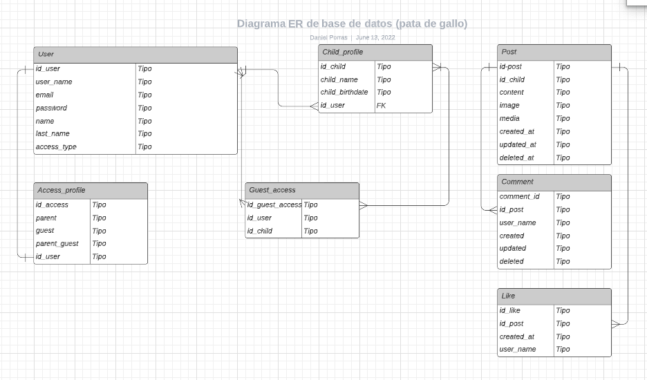 

## Features

### Home Page

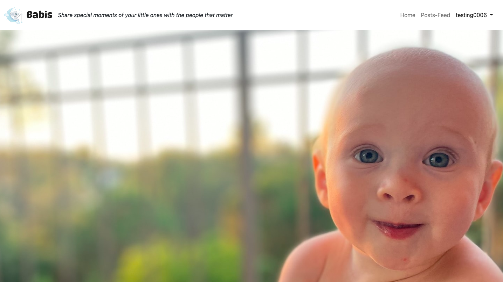

* The hero image welcomes  

### About Section

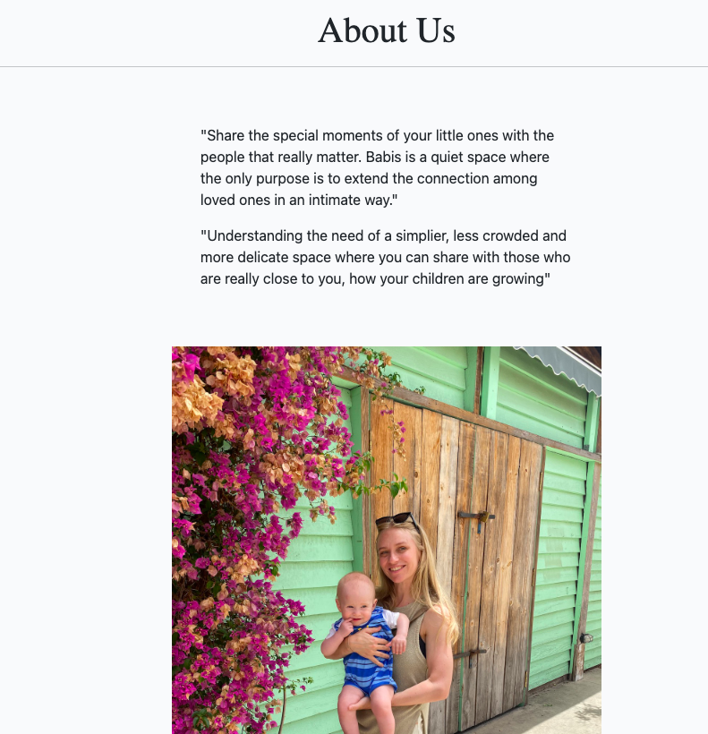

* The About Page gives, users information about the the purpose and goals of Babis. 

### Blog Page

* The user is welcomed to the page and depending on the type of user(guest user or parent user) it will render different options 

### Post Detail Page - Top

* On this page the users can start posting on the feeds page. Here they will see the posts of all the babies the users are friends with 

### Post Detail Page - Steps

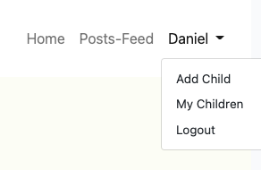

* If the user is parent, it will have a different Navigations than if the user is guest. 
 parent users can add children and see a page where they have the children they have created a profile for.  
 

### Post Detail Page - Comments

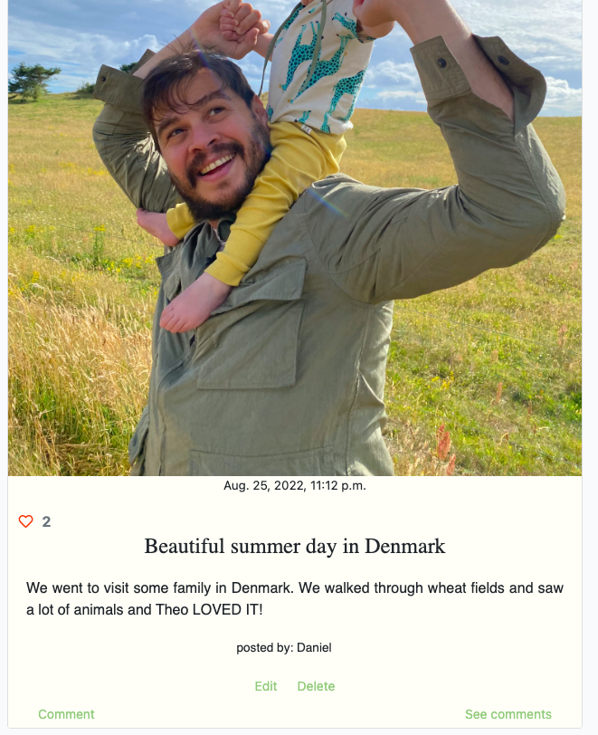

* At the bottom of this page, users can read the comments posted by other users. If the user is logged in or is a 
superuser they have access to the buttons for deleting or updating comments.

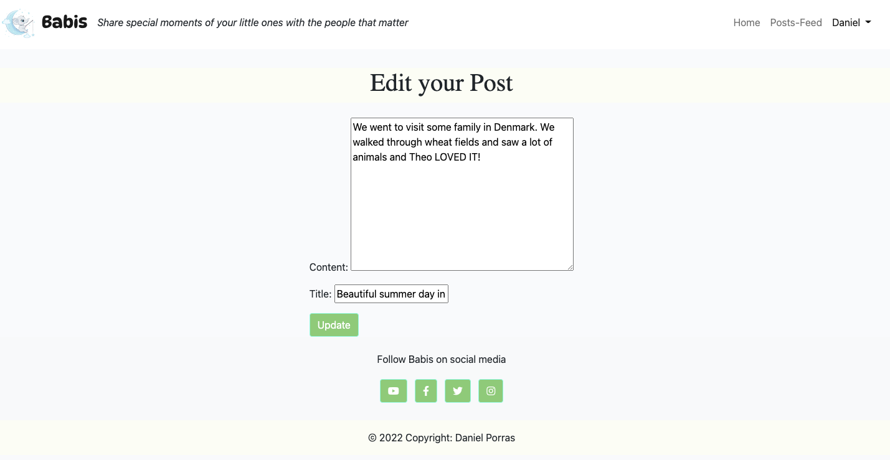

* On this page, users can edit their posts

###  Comments Page

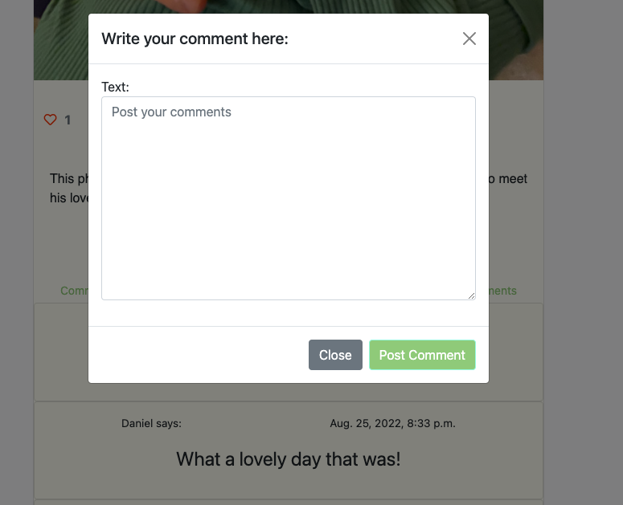

* On this page, users are allowed to comment. The website superuser can 
  delete or update any comments on the blog without having to access the admin panel.

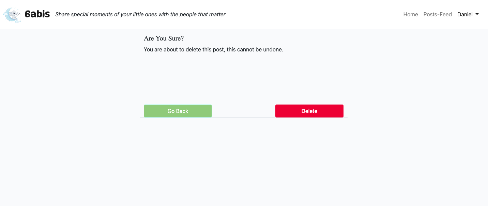

### Signup Page

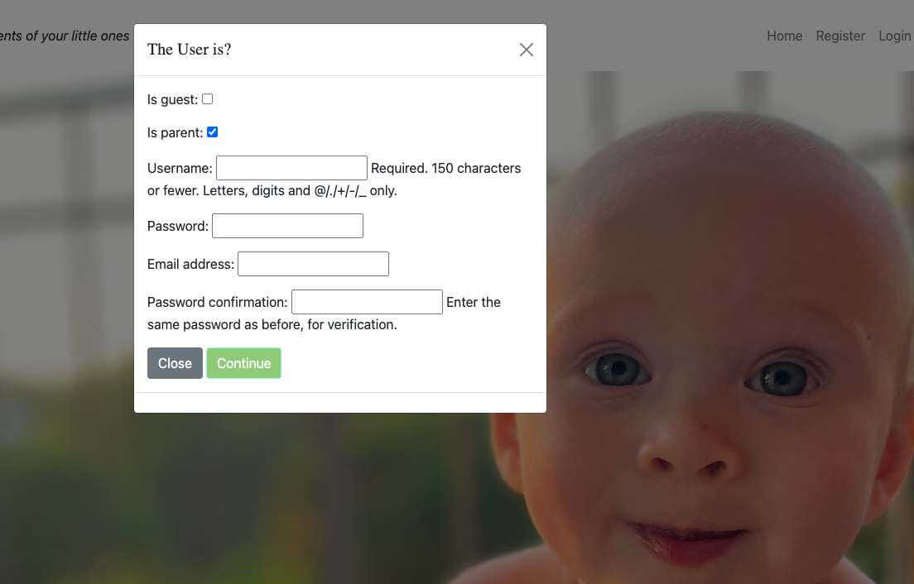

* On the Signup modal, a new user can sign up by clicking on the register button on the landing page by filling out and then submitting the form. The form will give two different types of users. A parent user or a guest user. If the user is parent then it will
be able to add children profiles but if the user is guest it would only be allowed to post something. 

### Login Page

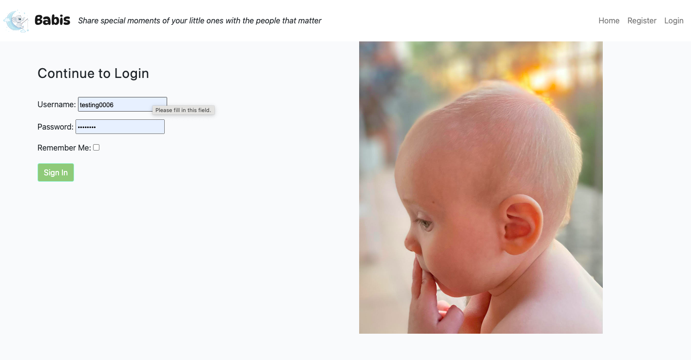

* On the Login Page, users can log in to the website by inputting the username and password and have access 
  to website services for a user registered.

### Logout Page

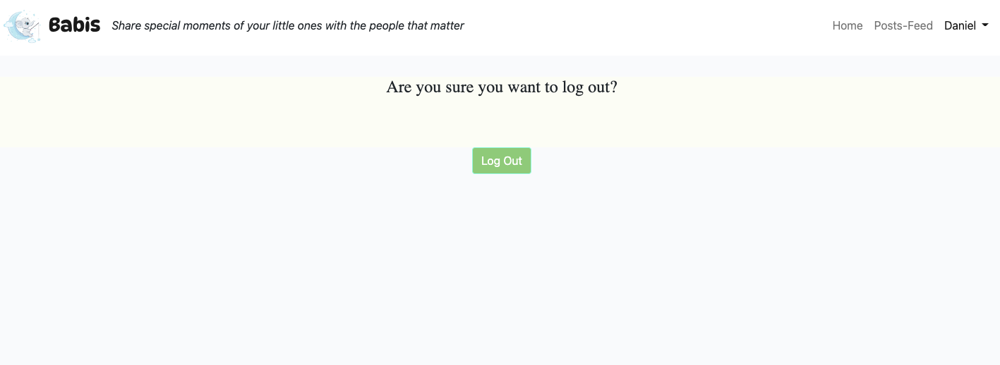

* On the Logout Page, users can confirm that they wish to exit the website.

* The navigation bar is present at the top of every page and houses all links to the various other pages.
* The options to Register or Log in will change to the option to log out once a user has logged in.
* Once a user has signed in, more options such as feed post page and user name with dropdown menu will be available in the navbar.
* The navbar is fully responsive, collapsing into a hamburger menu when the screen size becomes smaller.

### Footer

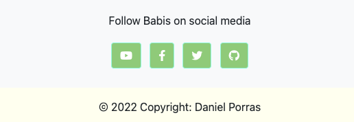
* On the website footer, users can see basic  social media and
  copyright.

## Admin Panel/Superuser
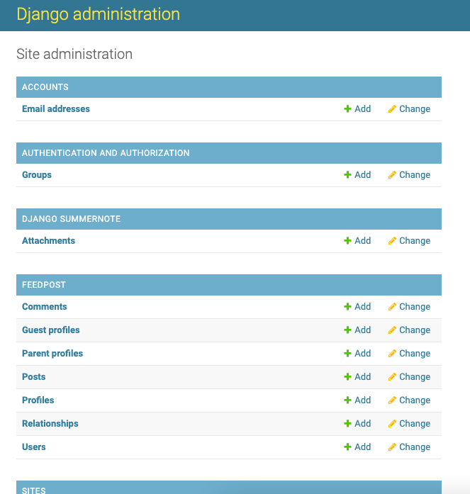

* On the Admin Panel, as an admin/superuser I have full access to CRUD functionality so I can view, create, edit and
delete the following ones:
1. Posts
2. Comments
3. Author
4. Profiles
6. Friends
7. User
   
 

## Technologies Used

### Languages Used

* [HTML 5](https://en.wikipedia.org/wiki/HTML/)
* [CSS 3](https://en.wikipedia.org/wiki/CSS)
* [JavaScript](https://www.javascript.com/)
* [Django](https://www.python.org/)
* [Python](https://www.djangoproject.com/)

#### Django Packages

* [Gunicorn](https://gunicorn.org/) 
   As the server for Heroku
* [Cloudinary](https://cloudinary.com/) 
   Was used to host the static files and media
* [Dj_database_url](https://pypi.org/project/dj-database-url/) 
   To parse the database URL from the environment variables in Heroku
* [Psycopg2](https://pypi.org/project/psycopg2/) 
   As an adaptor for Python and PostgreSQL databases
* [Summernote](https://summernote.org/) 
   As a text editor
* [Allauth](https://django-allauth.readthedocs.io/en/latest/installation.html) 
   For authentication, registration, account
   management
* [Crispy Forms](https://django-crispy-forms.readthedocs.io/en/latest/) 
   To style the forms

### Frameworks - Libraries - Programs Used

* [Bootstrap](https://getbootstrap.com/) 
   Was used to style the website, add responsiveness and interactivity
* [Jquery](https://jquery.com/) 
   All the scripts were written using jquery library
* [Git](https://git-scm.com/) 
   Git was used for version control by utilizing the Gitpod terminal to commit to Git and push to GitHub
* [GitHub](https://github.com/) 
   GitHub is used to store the project's code after being pushed from Git
* [Heroku](https://id.heroku.com) 
   Heroku was used to deploy the live project
* [PostgreSQL](https://www.postgresql.org/) 
   Database used through heroku.
* [VSCode](https://code.visualstudio.com/) 
   VSCode was used to create and edit the website
* [Lucidchart](https://lucid.app/) 
   Lucidchart was used to create the database diagram
* [PEP8](http://pep8online.com/) 
   PEP8 was used to validate all the Python code
* [W3C - HTML](https://validator.w3.org/) 
   W3C- HTML was used to validate all the HTML code
* [W3C - CSS](https://jigsaw.w3.org/css-validator/) 
   W3C - CSS was used to validate the CSS code
* [Fontawesome](https://fontawesome.com/) 
   To add icons to the website
* [Google Chrome Dev Tools](https://developer.chrome.com/docs/devtools/) 
   To check App responsiveness and debugging
* [Google Fonts](https://fonts.google.com/) 
   To add the 2 fonts that were used throughout the project
* [Balsamiq](https://balsamiq.com/) 
   To build the wireframes for the project

## Creating the Django app

1. Go to the Code Institute Gitpod Full Template [Template](https://github.com/Code-Institute-Org/gitpod-full-template)
2. Click on Use This Template
3. Once the template is available in your repository click on Gitpod
4. When the image for the template and the Gitpod are ready open a new terminal to start a new Django App
5. Install Django and gunicorn: `pip3 install django gunicorn`
6. Install supporting database libraries dj_database_url and psycopg2 library: `pip3 install dj_database_url psycopg2`
7. Create file for requirements: in the terminal window type `pip freeze --local > requirements.txt`
8. Create project: in the terminal window type django-admin startproject your_project_name
9. Create app: in the terminal window type python3 manage.py startapp your_app_name
10. Add app to the list of installed apps in settings.py file: you_app_name
11. Migrate changes: in the terminal window type python3 manage.py migrate
12. Run the server to test if the app is installed, in the terminal window type python3 manage.py runserver
13. If the app has been installed correctly the window will display The install worked successfully! Congratulations!

## Deployment of This Project

* This site was deployed by completing the following steps:

1. Log in to [Heroku](https://id.heroku.com) or create an account
2. On the main page click the button labelled New in the top right corner and from the drop-down menu select Create New
App
3. You must enter a unique app name
4. Next select your region
5. Click on the Create App button
6. Click in resources and select Heroku Postgres database
7. Click Reveal Config Vars and add a new record with SECRET_KEY
8. Click Reveal Config Vars and add a new record with the `CLOUDINARY_URL`
9. Click Reveal Config Vars and add a new record with the `DISABLE_COLLECTSTATIC = 1`
10. The next page is the project’s Deploy Tab. Click on the Settings Tab and scroll down to Config Vars
11. Next, scroll down to the Buildpack section click Add Buildpack select python and click Save Changes
12. Scroll to the top of the page and choose the Deploy tab
13. Select Github as the deployment method
14. Confirm you want to connect to GitHub
15. Search for the repository name and click the connect button
16. Scroll to the bottom of the deploy page and select the preferred deployment type
17. Click either Enable Automatic Deploys for automatic deployment when you push updates to Github

## Final Deployment 

1. Create a runtime.txt `python-3.8.13`
2. Create a Procfile `web: gunicorn your_project_name.wsgi`
3. When development is complete change the debug setting to: `DEBUG = False` in settings.py
4. In this project the summernote editor was used so for this to work in Heroku add: `X_FRAME_OPTIONS = SAMEORIGIN `to
   settings.py.
5. In Heroku settings, delete the config vars for `DISABLE_COLLECTSTATIC = 1`

## Credits

### Content

* All photos that have been used in this project are of my son Theo Porras Tiderman  
* The logo baby elephant was taken from www.vecteezy.com/free-vector/baby-elephant
* 

### Information Sources / Resources

* [W3Schools - Python](https://www.w3schools.com/python/)
* [Stack Overflow](https://stackoverflow.com/)

## Special Thanks

* Special thanks to my colleagues at Code Institute who supported this project, special thanks to my colleague Matt Boden and all the extremely qualified Student Support team from Code Institute. 